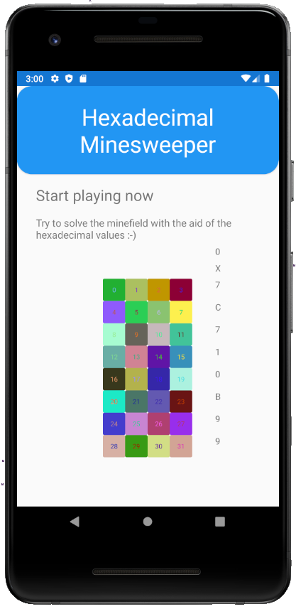

# HeXMines
This is a Minesweeper like game built in Xamarin Forms.
The minefield has the size of a 32 bit word and is grouped in nibbles. 
As a hint you get the hexadecimal representation of the places where mines
are. The only tricky thing is you have to figure out if the nibbles are lsb or msb.
   

